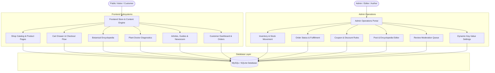

<p align="center">
  
</p>

<h1 align="center">Plantora — E-Commerce Marketplace & Botanical Encyclopedia Platform</h1>

<p align="center">
  <b>A comprehensive, full-stack Laravel 12 application combining a modern plant marketplace, botanical encyclopedia, diagnostic plant doctor, and multi-author editorial publishing platform.</b>
</p>

<p align="center">
  
  
  
  
  
  
</p>

---

## 🌿 System Overview

**Plantora** is an all-in-one web application designed for botanical e-commerce businesses, online nurseries, and plant care communities. The platform integrates:
- **E-Commerce Marketplace**: Full product catalog, variants, custom attributes, cart drawer, discount coupon engine, dynamic shipping calculation, checkout flow, order tracking, and customer address management.
- **Botanical Encyclopedia**: Detailed plant species directory complete with scientific taxonomy, pet toxicity warnings, light/water schedules, soil requirements, and seasonal care guides.
- **Plant Doctor Diagnostic Center**: Interactive symptom-to-treatment lookup system for plant diseases, pests, fungal infections, and nutrient deficiencies.
- **Editorial Publishing System**: Rich multi-author blogging engine for botanical articles, step-by-step growing guides, and plant news.
- **Admin Operations Dashboard**: Role-Based Access Control (RBAC) portal managing products, stock movements, order processing, coupon rules, plant entries, review moderation, media assets, and site configurations.

---

## 🏗️ System Architecture



---

## ✨ Exhaustive Feature Matrix

### 🛒 1. E-Commerce Marketplace & Checkout Engine

| Feature | Technical Description |
| :--- | :--- |
| **Product Catalog (`/shop`)** | Searchable grid with category filtering, price sliders, stock availability filters, and sorting options (Price Low-to-High, High-to-Low, Latest, Top Rated). |
| **Product Variants & Attributes** | Dynamic support for multi-variant products (e.g., Pot Color, Size, Package Weight) backed by `ProductVariant`, `ProductAttribute`, and `ProductAttributeValue`. |
| **Product Gallery & Media** | Multi-image product showcases powered by `ProductImage` with primary image flags and optimized thumbnail loading. |
| **Real-Time Cart Drawer & Cart Page** | Slide-over cart drawer and full `/cart` page with line-item quantity controls, subtotal auto-calculations, and persistent database/session cart state. |
| **Discount & Coupon Engine** | Percentage-based or fixed-amount promotional codes with expiration dates, minimum spending thresholds, usage caps per user, and redemptions ledger (`coupons`, `coupon_usages`). |
| **Dynamic Shipping Methods** | Configurable shipping providers (Flat Rate, Express, Free Shipping Thresholds, Nursery Pickup) calculated dynamically during checkout (`shipping_methods`). |
| **Multi-Step Checkout (`/checkout`)** | Address selection, dynamic fee calculation, instant order creation with unique tracking identifiers (`PLN-YYYYMMDD-XXXX`), and order status history logging. |
| **Product Reviews & Ratings** | Star ratings (1–5 scale), text reviews, customer verification badges, and an admin moderation workflow (`product_reviews`). |
| **Customer Wishlist** | Instant AJAX wishlist toggling for registered customers with persistence across sessions (`wishlists`). |

---

### 🪴 2. Botanical Encyclopedia (`/plants`)

| Feature | Technical Description |
| :--- | :--- |
| **Species Directory** | Comprehensive plant catalog with scientific taxonomy, plant family, geographic origin, growth rate, mature height, and toxicity/pet-safety alerts. |
| **Care Requirement Matrix** | Granular data model (`plant_cares`) tracking: ☀️ Light intensity & window placement, 💧 Watering frequency & humidity %, 🧪 Soil mixture & pH range, 🌡️ Min/max temperature tolerance, 🌿 Fertilizer type & feeding schedule, ✂️ Pruning & repotting frequency. |
| **Common Names & Synonyms** | Multi-alias index (`plant_common_names`) allowing users to find plants via local or regional names (e.g., *Monstera deliciosa* vs. *Swiss Cheese Plant*). |
| **Seasonal Care Guides** | Customized growing routines for Spring, Summer, Autumn, and Winter growth cycles (`plant_seasons`). |

---

### 🩺 3. Plant Doctor Diagnostic Portal (`/plant-problems`)

| Feature | Technical Description |
| :--- | :--- |
| **Symptom Lookup** | Visual diagnostic index for plant leaf discoloration, pest infestation, root rot, fungal spots, and wilting (`plant_problems`). |
| **Pathogen & Cause Breakdown** | In-depth cause analysis (`plant_problem_causes`) identifying viral, bacterial, fungal, insect, or environmental stress roots. |
| **Multi-Tier Treatment Plans** | Step-by-step recovery steps (`plant_problem_treatments`) divided into Organic Remedies, Chemical Treatments, and Culture Adjustments. |
| **Prevention & Affected Species** | Preventive maintenance guidelines (`plant_problem_preventions`) linked directly to vulnerable host plant species. |

---

### 📰 4. Multi-Author Editorial Engine (`/articles`, `/guides`, `/news`)

| Feature | Technical Description |
| :--- | :--- |
| **Content Publishing Suite** | Manage Botanical Articles, Step-by-Step Growing Tutorials, and Industry News with rich text, featured images, reading time estimates, and publication states. |
| **Taxonomy & Tagging** | Content categorization (`content_categories`) and cross-referencing tags (`tags`) for optimal content discoverability. |
| **Author Profiles** | Author profile bios, avatars, social links, and dedicated author archive pages (`/authors/{id}`). |
| **SEO & Schema Markup** | Built-in JSON-LD microdata formatting (`Article`, `NewsArticle`, `Product`, `Organization`) for Google Rich Snippets. |

---

### 👤 5. Customer Account Portal (`/account`)

| Feature | Technical Description |
| :--- | :--- |
| **Account Dashboard** | Centralized dashboard displaying order history stats, default shipping address, and recent wishlist additions. |
| **Order History & Management** | Detail views (`/account/orders/{order_number}`) showing line items, pricing breakdown, shipping tracking, and order cancellation capability for pending orders. |
| **Address Book** | Full CRUD address manager (`customer_addresses`) supporting default billing and shipping address flags. |

---

### ⚙️ 6. Admin Operations Portal (`/admin`)

| Feature | Technical Description |
| :--- | :--- |
| **Role-Based Security** | Protected by `role:admin,editor,author` middleware supporting granular permission checks. |
| **Operations Dashboard** | Key metrics including Total Revenue, Total Orders, Active Products, Customer Count, and Low-Stock Warnings. |
| **Inventory Ledger (`/admin/inventory`)** | Stock tracking with historical audit logs (`inventory_movements`) for stock-ins, sales deductions, and manual adjustments. |
| **Order Management & Status Workflow** | Update order statuses (`Pending` ➔ `Processing` ➔ `Shipped` ➔ `Delivered` ➔ `Cancelled`) with automatic timestamping in `order_status_histories`. |
| **Plant & Problem CMS** | Complete admin interface to create, duplicate, edit, and publish encyclopedia entries and diagnostic problem guides. |
| **Review Moderation Queue** | Approve, hide, or remove customer reviews prior to public display. |
| **Media Library (`/admin/media`)** | Central asset manager for media uploads, image resizing, alt text configuration, and file deletion. |
| **Newsletter Lead Directory** | Exportable subscriber directory (`newsletter_subscribers`) captured via footer and homepage opt-in forms. |
| **Dynamic Key-Value Settings Engine** | Manage site name, logo, contact emails, currency symbol, social links, and SEO defaults stored dynamically in the `settings` table. |

---

### 🌐 7. SEO, Performance & System Utilities

| Feature | Technical Description |
| :--- | :--- |
| **Automated XML Sitemaps** | Dynamic index at `/sitemap.xml` with specialized child sitemaps (`/sitemaps/products.xml`, `/sitemaps/plants.xml`, `/sitemaps/posts.xml`). |
| **URL Redirect Engine** | Database-driven 301/302 URL redirection table (`url_redirects`) to preserve SEO authority during route changes. |
| **Complete Favicon Suite** | Multi-size ICO (16x16, 32x32, 48x48, 64x64), SVG vector icon, Apple Touch Icon (180x180), Android Chrome (192x192, 512x512), and `site.webmanifest`. |

---

## 🗄️ Database Schema & Model Directory (41 Entities)

The application database encompasses 41 specialized Eloquent models:

| Entity Group | Model Name | Primary Purpose |
| :--- | :--- | :--- |
| **Core & Users** | `User` | Authentication, RBAC roles (`admin`, `editor`, `author`, `customer`), avatars. |
| | `AuthorProfile` | Public author bios, credentials, and social links. |
| | `CustomerAddress` | Saved customer shipping and billing addresses. |
| **Marketplace** | `Product` | Main product catalog items, prices, SKUs, stock levels, and SEO attributes. |
| | `ProductCategory` | Hierarchical product categories (Indoor Plants, Seeds, Pots, Tools). |
| | `ProductCollection` | Curated product groupings (e.g., Best Sellers, Low Light Favorites). |
| | `ProductVariant` | SKU variations (size, color, pot style). |
| | `ProductAttribute` | Dynamic attribute keys (e.g., Color, Pot Diameter). |
| | `ProductAttributeValue` | Specific attribute option values. |
| | `ProductImage` | Product gallery assets and primary flags. |
| | `ProductReview` | Ratings, feedback text, verified purchase status, and approval flags. |
| **Cart & Orders** | `Cart` | Session or user cart container. |
| | `CartItem` | Line items in cart with quantity and variant selections. |
| | `Order` | Finalized order records with order tracking number, totals, and status. |
| | `OrderItem` | Snapshot of purchased products, unit prices, and quantities. |
| | `OrderStatusHistory` | Historical audit log of order state changes. |
| | `Payment` | Payment transaction records, gateway responses, and status. |
| | `ShippingMethod` | Shipping rate rules, delivery estimates, and free shipping conditions. |
| | `Coupon` | Promo code rules, discount types (% or fixed), caps, and expiry dates. |
| | `CouponUsage` | Audit log tracking redemptions per customer/order. |
| | `InventoryMovement` | Stock adjustment ledger (Stock In, Sale, Return, Adjustment). |
| | `Wishlist` | User product bookmarks. |
| **Plant Encyclopedia**| `Plant` | Plant species profile, scientific taxonomy, pet safety, and growth traits. |
| | `PlantCategory` | Categorization (Succulents, Tropicals, Ferns, Flowering). |
| | `PlantCare` | Precise environmental care parameters (light, water, soil, fertilizer). |
| | `PlantCommonName` | Regional & common aliases for plant lookup. |
| | `PlantImage` | High-res botanical images. |
| | `PlantSeason` | Seasonal growth & dormant care guidelines. |
| **Plant Doctor** | `PlantProblem` | Disease, pest, and condition entries. |
| | `PlantProblemSymptom` | Visual disease indicators & leaf conditions. |
| | `PlantProblemCause` | Biological & environmental root causes. |
| | `PlantProblemTreatment` | Organic and chemical treatment procedures. |
| | `PlantProblemPrevention` | Long-term prevention strategies. |
| **Content Engine** | `Post` | Articles, step-by-step guides, and news items. |
| | `ContentCategory` | Article and news categories. |
| | `Tag` | Tagging system across articles and products. |
| | `PostSource` | Citation sources and external references for research articles. |
| **System Utilities** | `Media` | Centralized media library asset records. |
| | `Setting` | Key-value system configuration records. |
| | `NewsletterSubscriber`| Email subscriber leads. |
| | `UrlRedirect` | 301/302 SEO URL redirection map. |

---

## 🛣️ Complete Route Map

### 🌐 Public Frontend Routes
```
GET     /                                   --> Frontend\HomeController@index
GET     /shop                               --> Frontend\ShopController@index
GET     /shop/category/{slug}              --> Frontend\ShopController@category
GET     /shop/products/{slug}              --> Frontend\ShopController@show
GET     /cart                               --> Frontend\CartController@index
POST    /cart/add                           --> Frontend\CartController@add
PUT     /cart/items/{id}                   --> Frontend\CartController@update
DELETE  /cart/items/{id}                   --> Frontend\CartController@remove
POST    /cart/coupon                        --> Frontend\CartController@applyCoupon
DELETE  /cart/coupon                       --> Frontend\CartController@removeCoupon
GET     /plants                             --> Frontend\PlantController@index
GET     /plants/{slug}                      --> Frontend\PlantController@show
GET     /plant-problems                     --> Frontend\PlantProblemController@index
GET     /plant-problems/{slug}              --> Frontend\PlantProblemController@show
GET     /articles                           --> Frontend\ArticleController@index
GET     /articles/category/{slug}           --> Frontend\ContentCategoryController@show
GET     /articles/{slug}                    --> Frontend\ArticleController@show
GET     /guides                             --> Frontend\GuideController@index
GET     /guides/{slug}                      --> Frontend\GuideController@show
GET     /news                               --> Frontend\NewsController@index
GET     /news/{slug}                        --> Frontend\NewsController@show
GET     /authors/{user}                     --> Frontend\AuthorController@show
GET     /search                             --> Frontend\SearchController@index
POST    /newsletter/subscribe               --> Frontend\NewsletterController@subscribe
GET     /sitemap.xml                        --> Frontend\SitemapController@index
GET     /sitemaps/{type}.xml                --> Frontend\SitemapController@show
```

### 🔐 Auth & Account Routes
```
GET|POST /login, /register, /logout
GET|POST /forgot-password, /reset-password
GET      /account/dashboard                 --> Frontend\CustomerAccountController@dashboard
GET      /account/orders                    --> Frontend\CustomerAccountController@orders
GET      /account/orders/{order_number}     --> Frontend\CustomerAccountController@showOrder
POST     /account/orders/{order}/cancel     --> Frontend\CustomerAccountController@cancelOrder
GET|POST /account/addresses                 --> Frontend\CustomerAccountController@addresses
GET      /checkout                          --> Frontend\CheckoutController@index
POST     /checkout                          --> Frontend\CheckoutController@process
GET      /checkout/success/{order_number}   --> Frontend\CheckoutController@success
POST     /wishlist/toggle/{product}         --> Frontend\WishlistController@toggle
POST     /products/{product}/reviews        --> Frontend\ProductReviewController@store
```

### ⚙️ Admin Operations Routes (`/admin`)
```
GET     /admin                              --> Admin\DashboardController@index
RESOURCE /admin/users                       --> Admin\UserController
RESOURCE /admin/products                    --> Admin\ProductController
RESOURCE /admin/product-categories          --> Admin\ProductCategoryController
GET      /admin/inventory                   --> Admin\InventoryController@index
GET|POST /admin/orders                      --> Admin\OrderController
RESOURCE /admin/coupons                     --> Admin\CouponController
GET|POST /admin/reviews                     --> Admin\ProductReviewController
RESOURCE /admin/shipping-methods            --> Admin\ShippingMethodController
RESOURCE /admin/plants                      --> Admin\PlantController
POST     /admin/plants/{plant}/duplicate    --> Admin\PlantController@duplicate
RESOURCE /admin/plant-categories            --> Admin\PlantCategoryController
RESOURCE /admin/plant-problems              --> Admin\PlantProblemController
RESOURCE /admin/posts                       --> Admin\PostController
POST     /admin/posts/{post}/duplicate      --> Admin\PostController@duplicate
GET      /admin/posts/{post}/preview        --> Admin\PostController@preview
RESOURCE /admin/content-categories          --> Admin\ContentCategoryController
RESOURCE /admin/tags                        --> Admin\TagController
GET|POST /admin/media                       --> Admin\MediaController
GET|POST /admin/settings                    --> Admin\SettingsController
GET|DELETE /admin/newsletter-subscribers    --> Admin\NewsletterSubscriberController
```

---

## ⚙️ Installation & Setup Guide

### System Requirements
- **PHP**: `^8.2` with `pdo`, `mbstring`, `openssl`, `gd`/`fileinfo` extensions
- **Composer**: `^2.2`
- **Node.js**: `^18.0` or `^20.0`+
- **Database**: MySQL `^8.0` or SQLite `^3.35`

### 🚀 Quickstart Installation Steps

1. **Clone the Repository**
   ```bash
   git clone https://github.com/huziee/plant-marketplace.git
   cd plant-marketplace
   ```

2. **Install PHP & Node Dependencies**
   ```bash
   composer install
   npm install
   ```

3. **Configure Environment File**
   ```bash
   cp .env.example .env
   php artisan key:generate
   ```
   *Update your `.env` database connection parameters (`DB_DATABASE`, `DB_USERNAME`, `DB_PASSWORD`).*

4. **Run Database Migrations & Seeders**
   ```bash
   php artisan migrate --seed
   ```

5. **Link Storage Directory**
   ```bash
   php artisan storage:link
   ```

6. **Start Local Development Environment**
   ```bash
   # Option A: Run via Composer dev script (starts server, queue, logs & vite concurrently)
   composer dev

   # Option B: Run commands in separate terminals
   php artisan serve
   npm run dev
   ```

7. **Access the Application**
   - **Frontend Marketplace**: `http://127.0.0.1:8000` (or `http://plant-marketplace.test`)
   - **Admin Operations Dashboard**: `http://127.0.0.1:8000/admin`

---

## 🔑 Default Seeder Credentials

When running `php artisan db:seed`, the system automatically provisions seeded accounts:

| Role | Email | Password | Access Level |
| :--- | :--- | :--- | :--- |
| **Administrator** | `admin@plantora.com` | `password` | Full System Access & Settings |
| **Editor** | `editor@plantora.com` | `password` | Content, Products & Orders |
| **Customer** | `customer@plantora.com` | `password` | Shopping, Checkout & Account |

---

## 📁 Repository Structure

```
plant-marketplace/
├── app/
│   ├── Helpers/            # Helper functions (e.g., settings helper)
│   ├── Http/
│   │   ├── Controllers/    # Admin, Auth & Frontend Controllers
│   │   └── Middleware/     # Role-based authorization middleware
│   └── Models/             # 41 Eloquent Data Models
├── database/
│   ├── factories/          # Test data factories
│   ├── migrations/         # Database table definitions
│   └── seeders/            # Initial dataset seeders
├── public/
│   ├── build/              # Compiled Vite assets
│   ├── images/             # Brand logos & vector marks
│   ├── favicon.ico         # Multi-size ICO favicon
│   ├── favicon.svg         # SVG Vector favicon
│   └── site.webmanifest    # Web app PWA manifest
├── resources/
│   ├── css/                # App styling (Tailwind CSS v4 & custom tokens)
│   ├── js/                 # JavaScript modules
│   └── views/              # Blade layouts, partials & templates
│       ├── admin/          # Admin CRUD & management panels
│       ├── auth/           # Login, registration, password reset views
│       ├── errors/         # Custom HTTP error pages (404, 403, 500, 419)
│       ├── frontend/       # Storefront, encyclopedia, & article templates
│       └── layouts/        # Base HTML wrappers (app.blade.php, admin.blade.php)
├── routes/
│   ├── admin.php           # Protected Admin routes
│   ├── console.php         # Artisan commands
│   └── web.php             # Public & Customer routes
├── storage/                # App logs, uploads & cache
├── composer.json           # PHP dependencies & scripts
├── package.json            # Node.js dependencies
├── vite.config.js          # Vite build configuration
└── README.md               # System Documentation
```

---

## 📜 License

The Plantora application is open-source software licensed under the [MIT License](LICENSE).
